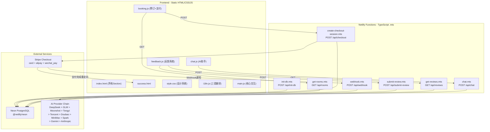
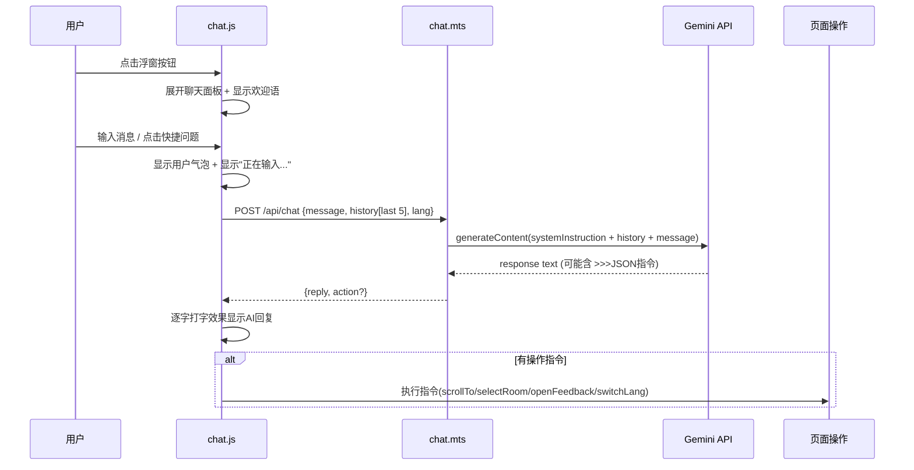

# 芒果海景酒店官网 - 商业级全栈开发计划

> 设计标准：大型商业级项目，Apple官网风格，世界最美度假胜地定位，WCAG AA无障碍，Lighthouse SEO满分，生产级错误处理与安全。

---

## 一、真实酒店数据（已爬取验证）

### 核心信息

- **全名**: 芒果海景酒店(三亚南边海鹿回头店) / Mango Sea View Hotel (Sanya Nanbian, Hailu Huitou) / Отель Манго с видом на море
- **地址**: 三亚市天涯区南边海路288号（近大东海广场）/ No. 288 Nanbianhai Road, Tianya District, Sanya
- **坐标**: 18.2278° N, 109.5120° E
- **建成/翻新**: 2014年建成，2019年全面翻新
- **客房总数**: 166间
- **入住/退房**: 10:00 AM / 14:00 PM
- **评分**: Trip.com 8.1/10（59条评价）
  - 清洁度 8.3 | 设施 8.0 | 位置 8.1 | 服务 7.9
- **支付**: 支付宝、微信支付、信用卡、现金
- **官方描述**: "Situated in the scenic Tianya District, Mango Sea View Hotel offers a welcoming coastal retreat just minutes from local highlights. The hotel features a modern design with subtle tropical influences, creating a calm and inviting atmosphere. Some accommodations include sea-view balconies, offering a relaxing space to unwind."
- **到达方式**: 距三亚凤凰国际机场 20.2km | 距三亚火车站 11.9km

### 完整设施清单

免费停车 | 免费WiFi | 海景房/海景阳台 | 无烟酒店 | 自助早餐(收费) | 商务中心 | 图书馆 | 电梯 | 行李寄存 | 礼宾服务 | 多语种员工 | 管家服务 | 会议厅 | 租车服务 | 24小时前台 | 客房送餐

### 周边景点（真实距离，已验证）

- 扬帆游轮/三亚湾夜游 330m
- 鹿回头风景区 370m（入口）/ 1.8km（公园核心区）
- 大东海 2.6km
- 大东海海滩 2.7km
- 三亚国际购物中心 3km
- 凤凰岛 4.1km
- 三亚湾 5.9km
- 椰梦长廊 6.1km
- 亚龙湾热带天堂森林公园 20.4km
- 亚龙湾 21km
- 天涯海角 ~23km
- 南山寺/南山文化旅游区 ~40km

---

## 二、技术架构全景




### 技术选型理由


| 层级   | 选型                       | 理由                                                                              |
| ---- | ------------------------ | ------------------------------------------------------------------------------- |
| 前端框架 | Vanilla HTML/CSS/JS      | 零依赖=极速FCP/LCP，Lighthouse性能满分基础                                                  |
| 后端   | Netlify Functions (.mts) | 与部署平台一体，冷启动快，自动伸缩                                                               |
| 数据库  | Neon PostgreSQL          | Serverless Postgres，@netlify/neon零配置连接                                          |
| 支付   | Stripe Checkout          | 托管支付页，PCI合规，原生支持card+alipay+wechat_pay                                          |
| AI   | 10-Provider Failover     | DeepSeek/GLM/Moonshot/Tongyi/Tencent/Doubao/MiniMax/Spark/Gemini/Anthropic 自动切换 |
| 部署   | Netlify                  | 全球CDN，自动HTTPS，Functions一体化，MCP工具可直接操作                                           |


### 关键技术约束

**Stripe货币兼容性**（已验证）：

- card: 支持几乎所有货币
- alipay: AUD, CAD, CNY, EUR, GBP, HKD, JPY, MYR, NZD, SGD, USD
- wechat_pay: AUD, CAD, CNY, EUR, GBP, HKD, JPY, SGD, USD, DKK, NOK, SEK, CHF
- **解决方案**: 使用 **CNY（人民币）** 作为统一结算货币，三种支付方式均支持。同时提供 USD 选项（也三者通用），前端根据语言自动选择默认货币，用户可手动切换。

**WeChat Pay 特殊要求**: 必须设置 `payment_method_options.wechat_pay.client: "web"`。

---

## 三、文件结构（完整）

```
芒果海景酒店官网/
├── index.html                              # 主页（全部Section + AI浮窗 + 反馈弹窗）
├── success.html                            # 支付成功确认页
├── css/
│   └── style.css                           # 完整设计系统（~1500行）
├── js/
│   ├── i18n.js                             # 三语翻译数据（~800行）
│   ├── main.js                             # 核心交互逻辑（~400行）
│   ├── booking.js                          # 预订+支付逻辑（~300行）
│   ├── chat.js                             # AI助手前端（~350行）
│   └── feedback.js                         # 反馈系统前端（~200行）
├── netlify/
│   └── functions/
│       ├── init-db.mts                     # 数据库初始化
│       ├── get-rooms.mts                   # 房型查询API
│       ├── create-checkout-session.mts     # Stripe支付
│       ├── webhook.mts                     # Stripe Webhook
│       ├── chat.mts                        # AI助手后端
│       ├── submit-review.mts              # 提交评价
│       └── get-reviews.mts               # 获取评价
├── package.json                            # 依赖声明
├── netlify.toml                            # 构建+函数+重定向配置
├── _headers                                # 安全头+缓存策略
├── sitemap.xml                             # SEO站点地图
├── robots.txt                              # 爬虫规则
└── .gitignore                              # node_modules, .netlify, .env
```

---

## 四、数据库设计（Neon PostgreSQL）

### 4.1 room_types 表

```sql
CREATE TABLE IF NOT EXISTS room_types (
  id          SERIAL PRIMARY KEY,
  slug        VARCHAR(50) UNIQUE NOT NULL,
  name_zh     VARCHAR(100) NOT NULL,
  name_en     VARCHAR(100) NOT NULL,
  name_ru     VARCHAR(100) NOT NULL,
  desc_zh     TEXT NOT NULL,
  desc_en     TEXT NOT NULL,
  desc_ru     TEXT NOT NULL,
  price_cny   INTEGER NOT NULL,
  price_usd   INTEGER NOT NULL,
  size_sqm    INTEGER NOT NULL,
  capacity    INTEGER NOT NULL,
  bed_type_zh VARCHAR(50) NOT NULL,
  bed_type_en VARCHAR(50) NOT NULL,
  bed_type_ru VARCHAR(50) NOT NULL,
  floor_range VARCHAR(20),
  image_url   TEXT NOT NULL,
  amenities   JSONB DEFAULT '[]',
  sort_order  INTEGER DEFAULT 0,
  is_active   BOOLEAN DEFAULT TRUE,
  created_at  TIMESTAMPTZ DEFAULT NOW()
);
```

**种子数据（4种房型）**:


| slug           | 中文名    | CNY/晚 | USD/晚 | 面积   | 人数  | 床型    | 楼层     |
| -------------- | ------ | ----- | ----- | ---- | --- | ----- | ------ |
| deluxe-ocean   | 豪华海景房  | 688   | 98    | 35m2 | 2   | 大床/双床 | 6-12F  |
| superior-suite | 高级海景套房 | 988   | 142   | 55m2 | 2   | 特大床   | 10-16F |
| family-ocean   | 家庭海景房  | 888   | 128   | 45m2 | 4   | 大床+双床 | 6-12F  |
| presidential   | 总统海景套房 | 1688  | 242   | 80m2 | 4   | 特大床   | 16-18F |


每个房型的 amenities JSONB 包含: ["ocean_view", "balcony", "wifi", "minibar", "safe", "rain_shower", "bathrobe", "tv_55inch"] 等（不同房型不同组合）。

### 4.2 bookings 表

```sql
CREATE TABLE IF NOT EXISTS bookings (
  id                SERIAL PRIMARY KEY,
  booking_no        VARCHAR(20) UNIQUE NOT NULL,
  room_type_id      INTEGER NOT NULL REFERENCES room_types(id),
  check_in          DATE NOT NULL,
  check_out         DATE NOT NULL,
  rooms             INTEGER NOT NULL DEFAULT 1,
  guests            INTEGER NOT NULL DEFAULT 1,
  guest_name        VARCHAR(100) NOT NULL,
  guest_email       VARCHAR(150) NOT NULL,
  guest_phone       VARCHAR(30),
  special_requests  TEXT,
  total_price       INTEGER NOT NULL,
  currency          VARCHAR(3) NOT NULL DEFAULT 'CNY',
  stripe_session_id VARCHAR(255),
  payment_status    VARCHAR(20) NOT NULL DEFAULT 'pending',
  payment_method    VARCHAR(20),
  lang              VARCHAR(5) DEFAULT 'zh',
  created_at        TIMESTAMPTZ DEFAULT NOW(),
  updated_at        TIMESTAMPTZ DEFAULT NOW()
);
```

`booking_no` 格式: `MG` + 年月日 + 4位随机数，如 `MG20260228-7392`。

### 4.3 reviews 表

```sql
CREATE TABLE IF NOT EXISTS reviews (
  id          SERIAL PRIMARY KEY,
  guest_name  VARCHAR(100) NOT NULL,
  guest_email VARCHAR(150),
  rating      INTEGER NOT NULL CHECK (rating >= 1 AND rating <= 5),
  title       VARCHAR(200),
  content     TEXT NOT NULL,
  lang        VARCHAR(5) NOT NULL DEFAULT 'zh',
  room_type   VARCHAR(50),
  stay_date   VARCHAR(20),
  status      VARCHAR(20) NOT NULL DEFAULT 'approved',
  created_at  TIMESTAMPTZ DEFAULT NOW()
);
```

**种子评价（6条，中英俄各2条）**:


| 语言  | 姓名         | 星级  | 标题                          | 内容摘要                                                                            |
| --- | ---------- | --- | --------------------------- | ------------------------------------------------------------------------------- |
| zh  | 张明辉        | 5   | 海景绝美，服务一流                   | 从阳台望去就是无敌海景，管家服务非常贴心…                                                           |
| zh  | 李雪梅        | 4   | 位置便利，值得推荐                   | 离大东海走路就能到，酒店2019年翻新后很干净…                                                        |
| en  | James W.   | 5   | Breathtaking Ocean Views    | The balcony view is absolutely stunning. Staff were incredibly helpful…         |
| en  | Sarah K.   | 4   | Great Location, Clean Rooms | Walking distance to Dadonghai Beach. Renovated in 2019, everything feels fresh… |
| ru  | Алексей П. | 5   | Потрясающий вид на море     | Вид с балкона просто невероятный. Персонал очень внимательный…                  |
| ru  | Мария С.   | 4   | Отличное расположение       | Близко к пляжу Дадунхай, номера чистые после ремонта 2019 года…                 |


---

## 五、前端设计系统（Apple风格 - 极致细节）

### 5.1 设计令牌（CSS Custom Properties）

```css
:root {
  /* 颜色系统 */
  --color-primary: #0071e3;          /* Apple蓝 - CTA按钮、链接 */
  --color-primary-hover: #0077ED;
  --color-gold: #c9a96e;             /* 金色 - 高端装饰 */
  --color-gold-light: #d4b87a;
  --color-dark: #1d1d1f;             /* 深色 - 标题、深色区域背景 */
  --color-gray-900: #2d2d2f;
  --color-gray-600: #6e6e73;         /* 副文本 */
  --color-gray-400: #a1a1a6;
  --color-gray-200: #d2d2d7;
  --color-gray-100: #f5f5f7;         /* 浅灰背景 */
  --color-white: #ffffff;
  --color-success: #30d158;
  --color-error: #ff3b30;
  --color-overlay: rgba(0,0,0,0.5);

  /* 字体系统 */
  --font-family: -apple-system, BlinkMacSystemFont, 'SF Pro Display',
    'SF Pro Text', 'PingFang SC', 'Helvetica Neue', 'Segoe UI',
    'Microsoft YaHei', sans-serif;
  --font-hero: clamp(3rem, 7vw, 5.5rem);
  --font-section-title: clamp(2rem, 4.5vw, 3.5rem);
  --font-subtitle: clamp(1.25rem, 2.5vw, 1.75rem);
  --font-body: clamp(1rem, 1.2vw, 1.125rem);
  --font-small: 0.875rem;
  --font-weight-bold: 700;
  --font-weight-semibold: 600;
  --font-weight-regular: 400;
  --letter-spacing-tight: -0.025em;

  /* 间距系统 */
  --section-padding: clamp(80px, 10vw, 140px);
  --content-max-width: 980px;
  --content-wide-width: 1200px;
  --content-padding: clamp(20px, 5vw, 40px);

  /* 圆角 */
  --radius-sm: 8px;
  --radius-md: 12px;
  --radius-lg: 18px;
  --radius-xl: 24px;
  --radius-full: 9999px;

  /* 阴影 */
  --shadow-sm: 0 2px 8px rgba(0,0,0,0.08);
  --shadow-md: 0 4px 20px rgba(0,0,0,0.12);
  --shadow-lg: 0 8px 40px rgba(0,0,0,0.16);
  --shadow-card-hover: 0 12px 48px rgba(0,0,0,0.2);

  /* 动画 */
  --ease-apple: cubic-bezier(0.25, 0.46, 0.45, 0.94);
  --ease-bounce: cubic-bezier(0.34, 1.56, 0.64, 1);
  --duration-fast: 0.3s;
  --duration-medium: 0.6s;
  --duration-slow: 0.8s;

  /* 毛玻璃 */
  --glass-bg: rgba(255,255,255,0.72);
  --glass-bg-dark: rgba(29,29,31,0.82);
  --glass-blur: saturate(180%) blur(20px);

  /* Z-index层级 */
  --z-nav: 1000;
  --z-chat: 1100;
  --z-modal: 1200;
  --z-lightbox: 1300;
  --z-toast: 1400;
}
```

### 5.2 响应式断点


| 断点           | 宽度         | 布局变化            |
| ------------ | ---------- | --------------- |
| Desktop      | > 1024px   | 全功能布局，Grid 2-4列 |
| Tablet       | 768-1024px | Grid 2列，导航简化    |
| Mobile       | 480-767px  | 单列，汉堡菜单，全宽卡片    |
| Small Mobile | < 480px    | 文字缩小，间距紧凑       |


### 5.3 核心CSS能力清单

- CSS Custom Properties 设计令牌系统
- 毛玻璃导航 (`backdrop-filter`)
- 全屏Hero + CSS视差 (`background-attachment: fixed` + JS增强)
- IntersectionObserver 滚动渐显动画 (fade-up / fade-in / scale-in)
- 房型卡片悬停缩放 + 阴影提升
- CSS Grid 瀑布流画廊
- 灯箱覆盖层 + 过渡动画
- scroll-snap 轮播
- AI聊天气泡 + 打字动画
- 星级评分交互样式
- 模态弹窗 + backdrop blur
- 骨架屏加载态
- Toast通知
- 回到顶部按钮
- 汉堡菜单 + 滑出动画
- `prefers-reduced-motion` 减弱动画
- `prefers-color-scheme: dark` 暗色模式基础适配
- `:focus-visible` 键盘焦点环
- 打印样式 (`@media print`)
- 4个响应式断点

---

## 六、页面Section详细设计

### Section 0: Navigation Bar

**HTML**: `<header>` > `<nav aria-label="Main navigation">`

- 左侧: 酒店名称/Logo（SVG内联，金色）
- 中部: 8个锚点链接 (首页/客房/设施/餐饮/景点/画廊/评价/预订)
- 右侧: 语言切换按钮组 (中 | EN | РУ)，当前语言高亮
- 移动端: 右侧汉堡按钮 -> 全屏覆盖菜单

**样式**:

```css
.nav {
  position: fixed; top: 0; width: 100%; z-index: var(--z-nav);
  background: var(--glass-bg);
  backdrop-filter: var(--glass-blur);
  -webkit-backdrop-filter: var(--glass-blur);
  border-bottom: 0.5px solid rgba(0,0,0,0.1);
  transition: background var(--duration-fast), box-shadow var(--duration-fast);
}
.nav--scrolled { box-shadow: var(--shadow-sm); }
```

**交互**:

- 滚动50px后增加阴影
- 点击锚点: `scrollIntoView({ behavior: 'smooth' })` + 关闭移动菜单
- 当前可视section对应nav链接自动高亮（IntersectionObserver）
- 语言切换: 即时更新所有 `[data-i18n]` 文本 + 保存到 `localStorage`
- 汉堡菜单: `<button aria-expanded="false" aria-controls="nav-menu">` 无障碍

### Section 1: Hero

**视觉**: 全屏(100vh)三亚海景日落大图，上覆半透明渐变遮罩

- 背景图: Unsplash高清热带海景（`srcset` 提供 1200w/1920w/2560w 三个尺寸）
- CSS视差: `background-attachment: fixed`（移动端降级为static避免抖动）

**内容**:

- 金色小字: "SANYA · HAINAN · CHINA"
- 超大标题: "芒果海景酒店" （`font-size: var(--font-hero); font-weight: 700`）
- 副标题: "在天涯海角，遇见最美的海" / "Where the horizon meets paradise" / "Где горизонт встречается с раем"
- CTA按钮: "立即预订" -> 平滑滚动到Booking区
- 底部: 向下箭头呼吸动画 (CSS `@keyframes bounce`)

**动画**: 标题从 `opacity:0; translateY(40px)` 渐入，延迟0.3s/0.6s/0.9s

### Section 2: About / 酒店简介

**布局**: 交错图文（CSS Grid `grid-template-columns: 1fr 1fr`，奇数行图左文右，偶数行反转）

**内容块1**: 品牌故事

- 图: 酒店外观全景
- 文: "坐落于三亚天涯区，毗邻鹿回头风景区，芒果海景酒店是一处充满热带风情的海滨度假胜地。2014年盛大开业，2019年全面翻新，现代设计与热带自然完美融合…"

**内容块2**: 数据展示

- 4个计数器动画: `166+` 间客房 | `2014` 年成立 | `8.1` 评分 | `24h` 服务
- 计数器从0滚动到目标值，IntersectionObserver触发，只执行一次

**内容块3**: 地理优势

- 图: 鹿回头日落/大东海航拍
- 文: "步行即达鹿回头风景区（370米），驱车5分钟抵达大东海海滩..."

### Section 3: Rooms / 客房套房

**数据源**: 从 `GET /api/rooms` 动态获取，加载前显示骨架屏

**布局**: CSS Grid 2列（移动端1列），4张大卡片

**卡片结构**:

```html
<article class="room-card" role="article" aria-labelledby="room-title-{slug}">
  <div class="room-card__image">
    
    <span class="room-card__price">¥688/晚</span>
  </div>
  <div class="room-card__content">
    <h3 id="room-title-{slug}">豪华海景房</h3>
    <div class="room-card__meta">35m² · 2人 · 大床/双床 · 6-12F</div>
    <p class="room-card__desc">面朝南海，推窗即享270°无敌海景…</p>
    <ul class="room-card__amenities" aria-label="房间设施">
      <li>海景阳台</li><li>免费WiFi</li><li>迷你吧</li>...
    </ul>
    <button class="btn btn--primary" data-room="{slug}">立即预订</button>
  </div>
</article>
```

**交互**:

- 悬停: `transform: translateY(-6px); box-shadow: var(--shadow-card-hover)`
- "立即预订"按钮: 滚动到Booking区 + 自动选中该房型
- 价格根据当前货币设置显示 CNY/USD

### Section 4: Facilities / 设施服务

**布局**: 4列网格（平板2列，手机2列）

**内容**: 8个设施项，每项含内联SVG图标 + 标题 + 一句描述

1. 免费WiFi - 全覆盖高速网络
2. 免费停车 - 地面停车场
3. 海景阳台 - 270°无敌海景
4. 自助早餐 - 海南特色美食
5. 管家服务 - 24小时专属管家
6. 商务中心 - 会议厅+办公设备
7. 租车服务 - 机场接送/景点包车
8. 行李寄存 - 24小时安全存放

**动画**: 每个设施项依次渐入，`animation-delay: calc(var(--i) * 0.1s)`

### Section 5: Dining / 餐饮美食

**视觉**: 全幅大图背景（海鲜/热带水果盛宴）+ 深色半透明遮罩 + 白色文字叠加

**内容**:

- 标题: "舌尖上的海南"
- 描述: 新鲜捕获的南海海鲜、地道海南鸡饭、热带水果盛宴
- 3个特色卡片（玻璃效果）: 海鲜大餐 | 热带果汁 | 海南早茶
- 早餐时间: 07:00 - 10:00

### Section 6: Attractions / 周边景点

**布局**: 水平滚动容器 (`overflow-x: auto; scroll-snap-type: x mandatory`)

**6张景点卡片**:

1. 鹿回头风景区 - 370m - "三亚城市地标，俯瞰三湾壮丽全景"
2. 大东海海滩 - 2.7km - "水暖沙白，三亚最成熟的海滨度假区"
3. 凤凰岛 - 4.1km - "地标人工岛，建筑群如海上明珠"
4. 椰梦长廊 - 6.1km - "20公里海滨大道，最美椰林日落"
5. 亚龙湾 - 21km - "天下第一湾，东方夏威夷"
6. 天涯海角 - 23km - "中国最南端，浪漫爱情圣地"

**每卡片**: 全高背景图 + 底部渐变 + 白色标题/距离标签
**导航**: 左右箭头按钮 + 底部圆点指示器

### Section 7: Gallery / 图片画廊

**布局**: CSS Grid 瀑布流效果

```css
.gallery-grid {
  display: grid;
  grid-template-columns: repeat(3, 1fr);
  grid-auto-rows: 200px;
  gap: 8px;
}
.gallery-item:nth-child(1) { grid-row: span 2; }  /* 大图 */
.gallery-item:nth-child(4) { grid-column: span 2; } /* 宽图 */
```

**内容**: 10-12张高清图片

- 酒店外观/夜景、大堂、海景房内部、阳台海景、泳池
- 三亚日落、椰林、海滩、热带花卉、海鲜美食、鹿回头夜景

**交互**:

- 悬停: 轻微放大 `scale(1.05)` + 遮罩 + 放大镜图标
- 点击: 灯箱全屏查看（暗色背景 + 居中大图 + 左右箭头 + 关闭按钮 + ESC关闭 + 键盘左右切换）
- 灯箱打开时 `body overflow: hidden`，焦点陷阱

### Section 8: Reviews / 宾客评价

**数据源**: 从 `GET /api/reviews` 动态获取

**内容结构**:

1. 评分总览: 大号 "8.1/10" + 4个维度进度条（清洁/设施/位置/服务）
2. 评价轮播: `scroll-snap` 水平滑动，自动播放（5秒间隔，悬停暂停）
3. "写评价"按钮 -> 打开反馈弹窗

**评价卡片**: 头像圆圈（首字母） + 姓名 + 日期 + 星级 + 标题 + 内容

### Section 9: Booking / 在线预订

**布局**: 左侧表单 + 右侧价格摘要面板（移动端上下堆叠）

**表单字段**:

- 入住日期 (`<input type="date" min="today">`)
- 退房日期 (`<input type="date" min="checkin+1">`)
- 房型选择 (`<select>` 从API获取选项)
- 房间数量 (1-5, `<select>`)
- 入住人数 (1-8, `<select>`)
- 姓名 (必填)
- 邮箱 (必填, email验证)
- 手机号 (选填)
- 特殊要求 (选填, `<textarea>`)
- 货币选择: CNY / USD 切换

**价格面板**:

```
房型: 豪华海景房          ¥688/晚
日期: 2026-03-01 → 03-04   3晚
房间: 2间
─────────────────────
房费小计               ¥4,128
服务费(5%)             ¥206
─────────────────────
合计                   ¥4,334
```

实时计算，任何字段变化立即更新

**支付按钮**: "立即预订并支付 ¥4,334" + 支付方式图标（Visa/MC/Alipay/WeChat）

- 点击 -> 验证表单 -> 显示加载态 -> POST /api/checkout -> 跳转Stripe

### Section 10: Footer

**布局**: 4列（移动端2列+折叠）

1. **酒店信息**: Logo + 地址 + 电话 + 邮箱
2. **快速导航**: 锚点链接
3. **关注我们**: 微信/微博/Instagram/Facebook 图标
4. **帮助**: 隐私政策 / 服务条款 / 无障碍声明

**底部**: 嵌入Google Map iframe（缩小版） + 版权 "© 2026 芒果海景酒店"

### 浮动组件: AI助手

**按钮**: 固定右下角(bottom:24px; right:24px)，56px圆形，主题蓝色，对话图标

- 未读指示器（首次访问3秒后显示提示气泡）
- 脉冲呼吸动画

**聊天面板**: 380px宽 x 520px高（移动端全屏），毛玻璃背景

- 头部: "小芒 AI助手" + 在线状态点 + 关闭按钮
- 消息区: 左侧AI气泡 + 右侧用户气泡，自动滚底
- 快捷问题栏: 4个芯片按钮（"房型价格" / "如何到达" / "周边景点" / "在线预订"）
- 输入区: `<input>` + 发送按钮

### 浮动组件: 反馈弹窗

**触发**: Reviews区"写评价"按钮 / Footer链接 / AI助手引导
**结构**: 模态对话框 `<dialog>` + backdrop blur

- 星级评分: 5颗星SVG，点击/悬停交互
- 姓名(必填) + 邮箱(选填) + 标题(选填) + 内容(必填)
- 提交按钮 + 取消按钮
- 成功后: 绿色对勾动画 + "感谢您的评价" + 2秒后自动关闭

### 浮动组件: 回到顶部

**按钮**: 滚动超过500px显示，固定左下角，40px圆形，半透明

- 点击: `window.scrollTo({ top: 0, behavior: 'smooth' })`

### 浮动组件: Toast通知

**位置**: 顶部居中，从上方滑入
**用途**: 语言切换确认 / 预订提交中 / 错误提示 / 评价提交成功

---

## 七、AI助手完整设计（10 Provider 自动 Failover）

### 7.1 多Provider架构与配置

**核心思想**: 10个AI服务商按优先级依次尝试，某个失败/超时则自动无感切换下一个。

Provider配置表（已验证API端点）:


| #   | Provider   | Base URL                                             | Model                     | 环境变量                |
| --- | ---------- | ---------------------------------------------------- | ------------------------- | ------------------- |
| 1   | DeepSeek   | `https://api.deepseek.com/v1`                        | `deepseek-chat`           | `DEEPSEEK_API_KEY`  |
| 2   | GLM 智谱     | `https://open.bigmodel.cn/api/paas/v4`               | `glm-4-flash`             | `GLM_API_KEY`       |
| 3   | Moonshot   | `https://api.moonshot.cn/v1`                         | `moonshot-v1-8k`          | `MOONSHOT_API_KEY`  |
| 4   | Tongyi 通义  | `https://dashscope.aliyuncs.com/compatible-mode/v1`  | `qwen-turbo`              | `TONGYI_API_KEY`    |
| 5   | Tencent 混元 | `https://hunyuan.cloud.tencent.com/openai/v1`        | `hunyuan-lite`            | `TENCENT_API_KEY`   |
| 6   | Doubao 豆包  | `https://ark.cn-beijing.volces.com/api/v3`           | `doubao-1-5-lite-32k`     | `DOUBAO_API_KEY`    |
| 7   | MiniMax    | `https://api.minimax.chat/v1/text/chatcompletion_v2` | `MiniMax-M2.5`            | `MINIMAX_API_KEY`   |
| 8   | Spark 星火   | `https://spark-api-open.xf-yun.com/v1`               | `lite`                    | `SPARK_API_KEY`     |
| 9   | Gemini     | `https://generativelanguage.googleapis.com/v1beta`   | `gemini-2.5-flash-lite`   | `GEMINI_API_KEY`    |
| 10  | Anthropic  | `https://api.anthropic.com/v1/messages`              | `claude-3-haiku-20240307` | `ANTHROPIC_API_KEY` |


前8个均为 OpenAI-compatible 格式（共用同一调用函数），Gemini和Anthropic各有轻量适配器（约20行）。

chat.mts 核心逻辑: 遍历 PROVIDERS 数组，每个Provider 8秒超时，跳过 key 为空的，全部失败返回静态友好回复+前台电话。

### 7.2 System Prompt（完整）

后端 `chat.mts` 中的 systemInstruction 将包含以下完整内容（约2000 tokens，远在免费额度内）：

```
你是芒果海景酒店的AI客服助手"小芒"。你温暖、专业、热情，就像一位在三亚生活多年的当地朋友。

## 身份
- 名字：小芒（英文 Mango，俄文 Манго）
- 角色：芒果海景酒店官方AI客服
- 风格：友好但专业，适度使用热带/海洋意象

## 酒店信息
- 名称：芒果海景酒店(三亚南边海鹿回头店)
- 地址：三亚市天涯区南边海路288号
- 电话：+86-898-88888888
- 入住/退房：10:00 / 14:00
- 客房：166间，4种房型
  1. 豪华海景房 ¥688/晚 35m² 2人 6-12F
  2. 高级海景套房 ¥988/晚 55m² 2人 10-16F
  3. 家庭海景房 ¥888/晚 45m² 4人 6-12F
  4. 总统海景套房 ¥1688/晚 80m² 4人 16-18F
- 设施：免费停车、免费WiFi、海景阳台、自助早餐、管家服务、商务中心、会议厅、租车、行李寄存、24h前台
- 评分：8.1/10 (清洁8.3 设施8.0 位置8.1 服务7.9)
- 交通：距机场20.2km 距火车站11.9km

## 周边景点
鹿回头370m、大东海2.7km、凤凰岛4.1km、椰梦长廊6.1km、亚龙湾21km、天涯海角23km、南山寺40km

## 操作能力
当用户需要执行操作时，在回复文本之后独立一行输出JSON指令（仅一个）：
- 滚动到页面区域：>>>{"action":"scrollTo","target":"rooms|facilities|dining|attractions|gallery|reviews|booking"}
- 预选房型并跳转预订：>>>{"action":"selectRoom","slug":"deluxe-ocean|superior-suite|family-ocean|presidential"}
- 打开反馈表单：>>>{"action":"openFeedback"}
- 切换语言：>>>{"action":"switchLang","lang":"zh|en|ru"}

## 规则
1. 根据用户使用的语言回复对应语言
2. 回答限于酒店相关话题，礼貌拒绝无关请求
3. 推荐房型时考虑人数、预算、偏好
4. 主动提供有用的额外信息（如附近餐厅、交通建议）
5. 不编造酒店没有的设施或服务
6. 回复简洁，通常不超过150字
```

### 7.3 前端交互流程




### 7.4 限流与错误处理

- 前端节流: 2秒内不能重复发送（按钮禁用+计时）
- 后端日限流: 当接近1000 RPD时，返回友好提示"今日咨询较多，请稍后再试或拨打前台电话"
- API错误: 显示"小芒暂时无法回答，请拨打前台 +86-898-88888888"
- 网络错误: 显示"网络连接不稳定，请检查后重试"

---

## 八、支付流程（完整）

### 8.1 前端流程（booking.js）

1. 用户填写表单，JS实时验证 + 实时计算价格
2. 点击"立即预订并支付"
3. 前端验证: 日期合法性（退房>入住，入住>=今天）+ 必填项 + 邮箱格式
4. 显示全屏加载遮罩 "正在创建订单..."
5. POST `/api/checkout` with:

```json
   {
     "roomTypeId": 1,
     "checkIn": "2026-03-01",
     "checkOut": "2026-03-04",
     "rooms": 2,
     "guests": 3,
     "guestName": "张三",
     "guestEmail": "zhang@example.com",
     "guestPhone": "+86-138xxxxxxxx",
     "specialRequests": "高层海景",
     "currency": "CNY",
     "lang": "zh"
   }
   

```

1. 收到 `{ checkoutUrl }` -> `window.location.href = checkoutUrl`
2. 错误 -> 隐藏加载态 -> Toast显示错误信息

### 8.2 后端流程（create-checkout-session.mts）

```
1. 验证请求体（所有必填字段 + 类型检查）
2. 从Neon查询room_type验证存在 + 获取价格
3. 计算总价: price × nights × rooms + 5%服务费
4. 生成booking_no: "MG" + YYYYMMDD + 4位随机数
5. INSERT INTO bookings (status='pending')
6. stripe.checkout.sessions.create({
     payment_method_types: ['card', 'alipay', 'wechat_pay'],
     payment_method_options: {
       wechat_pay: { client: 'web' }
     },
     line_items: [{
       price_data: {
         currency: 'cny',
         product_data: { name: '芒果海景酒店 - 豪华海景房 x2 (3晚)' },
         unit_amount: totalPrice * 100  // 分
       },
       quantity: 1
     }],
     mode: 'payment',
     success_url: SITE_URL + '/success.html?session_id={CHECKOUT_SESSION_ID}',
     cancel_url: SITE_URL + '/#booking',
     metadata: { booking_no, booking_id }
   })
7. UPDATE bookings SET stripe_session_id = session.id
8. 返回 { checkoutUrl: session.url }
```

### 8.3 Webhook流程（webhook.mts）

```
1. 验证Stripe签名 (stripe.webhooks.constructEvent)
2. 处理 'checkout.session.completed' 事件:
   - 从metadata获取 booking_id
   - UPDATE bookings SET payment_status='paid', payment_method=..., updated_at=NOW()
3. 返回 200 OK
```

### 8.4 成功页（success.html）

- 从URL参数获取 session_id
- 显示: 绿色对勾动画 + "预订成功" + 订单号 + 预订详情摘要
- "返回首页"按钮 + "打印确认单"按钮（`window.print()`，有打印专用CSS）
- 多语言支持（复用i18n.js）

---

## 九、SEO满分策略（Lighthouse 100目标）

### 9.1 HTML头部

```html
<!-- 基础Meta -->
<meta charset="UTF-8">
<meta name="viewport" content="width=device-width, initial-scale=1.0">
<title>芒果海景酒店 | 三亚海景度假酒店 - Mango Sea View Hotel Sanya</title>
<meta name="description" content="三亚芒果海景酒店，坐落天涯区南边海路，毗邻鹿回头风景区与大东海海滩。166间海景客房，270°无敌海景阳台。在线预订享最优价格。">
<meta name="keywords" content="三亚酒店,海景酒店,大东海酒店,鹿回头酒店,三亚度假,Sanya hotel,sea view hotel,Mango hotel">
<link rel="canonical" href="https://mango-seaview-hotel.netlify.app/">

<!-- Open Graph -->
<meta property="og:type" content="website">
<meta property="og:title" content="芒果海景酒店 | Mango Sea View Hotel Sanya">
<meta property="og:description" content="三亚天涯区海景度假酒店，毗邻鹿回头与大东海，166间海景客房在线预订">
<meta property="og:image" content="https://images.unsplash.com/photo-...?w=1200&h=630&fit=crop">
<meta property="og:url" content="https://mango-seaview-hotel.netlify.app/">
<meta property="og:locale" content="zh_CN">
<meta property="og:locale:alternate" content="en_US">
<meta property="og:locale:alternate" content="ru_RU">

<!-- Twitter Card -->
<meta name="twitter:card" content="summary_large_image">
<meta name="twitter:title" content="芒果海景酒店 | Mango Sea View Hotel">
<meta name="twitter:description" content="三亚海景度假酒店，鹿回头旁，大东海畔">
<meta name="twitter:image" content="https://images.unsplash.com/photo-...?w=1200&h=630&fit=crop">

<!-- hreflang -->
<link rel="alternate" hreflang="zh" href="https://mango-seaview-hotel.netlify.app/">
<link rel="alternate" hreflang="en" href="https://mango-seaview-hotel.netlify.app/?lang=en">
<link rel="alternate" hreflang="ru" href="https://mango-seaview-hotel.netlify.app/?lang=ru">
<link rel="alternate" hreflang="x-default" href="https://mango-seaview-hotel.netlify.app/">

<!-- Favicon -->
<link rel="icon" type="image/svg+xml" href="data:image/svg+xml,...">

<!-- Preload关键资源 -->
<link rel="preload" as="image" href="hero-image.webp">
<link rel="preload" as="style" href="css/style.css">
```

### 9.2 JSON-LD 结构化数据

```json
{
  "@context": "https://schema.org",
  "@type": "Hotel",
  "name": "芒果海景酒店",
  "alternateName": "Mango Sea View Hotel",
  "url": "https://mango-seaview-hotel.netlify.app",
  "image": "...",
  "description": "...",
  "address": {
    "@type": "PostalAddress",
    "streetAddress": "南边海路288号",
    "addressLocality": "三亚",
    "addressRegion": "海南",
    "postalCode": "572000",
    "addressCountry": "CN"
  },
  "geo": {
    "@type": "GeoCoordinates",
    "latitude": 18.2278,
    "longitude": 109.5120
  },
  "telephone": "+86-898-88888888",
  "checkinTime": "10:00",
  "checkoutTime": "14:00",
  "numberOfRooms": 166,
  "starRating": { "@type": "Rating", "ratingValue": "4" },
  "aggregateRating": {
    "@type": "AggregateRating",
    "ratingValue": "4.1",
    "bestRating": "5",
    "reviewCount": "59"
  },
  "amenityFeature": [
    {"@type": "LocationFeatureSpecification", "name": "Free WiFi", "value": true},
    {"@type": "LocationFeatureSpecification", "name": "Free Parking", "value": true},
    {"@type": "LocationFeatureSpecification", "name": "Ocean View", "value": true},
    {"@type": "LocationFeatureSpecification", "name": "Breakfast", "value": true},
    {"@type": "LocationFeatureSpecification", "name": "Business Center", "value": true},
    {"@type": "LocationFeatureSpecification", "name": "Concierge", "value": true}
  ],
  "makesOffer": [
    {
      "@type": "Offer",
      "name": "豪华海景房",
      "priceCurrency": "CNY",
      "price": "688",
      "itemOffered": {
        "@type": ["HotelRoom", "Product"],
        "name": "Deluxe Ocean View Room",
        "occupancy": {"@type": "QuantitativeValue", "value": 2},
        "bed": {"@type": "BedDetails", "typeOfBed": "King or Twin"}
      }
    }
  ],
  "paymentAccepted": "Credit Card, Alipay, WeChat Pay, Cash",
  "currenciesAccepted": "CNY, USD",
  "availableLanguage": ["Chinese", "English", "Russian"]
}
```

### 9.3 性能优化

- 零JS框架，CSS+JS总量目标 < 200KB（未压缩）
- 关键CSS内联（nav + hero）在 `<head>` 的 `<style>` 标签中
- 其余CSS通过 `<link rel="stylesheet">` 加载
- JS文件全部 `defer` 加载
- 图片: `loading="lazy"` + `width` + `height`（防止CLS）+ `srcset` 多尺寸
- Hero图: `<link rel="preload">` 预加载

### 9.4 其他SEO文件

**sitemap.xml**: 列出 index.html 和 success.html，含 lastmod
**robots.txt**: `Allow: /` + `Sitemap: https://...`
**_headers**: 缓存策略（CSS/JS/图片长缓存，HTML短缓存）

---

## 十、无障碍（WCAG 2.1 AA）

### 实施清单

- 语义化HTML5: `<header>`, `<nav>`, `<main>`, `<section>`, `<article>`, `<footer>`
- 每个section有 `aria-labelledby` 指向其 `<h2>` id
- 唯一 `<h1>` + 正确的 h1>h2>h3 层级
- 所有 `` 有 `alt` 属性（装饰图: `alt=""` + `role="presentation"`）
- 所有交互元素有 `aria-label`（图标按钮、语言切换、汉堡菜单）
- 汉堡菜单: `aria-expanded`, `aria-controls`
- 模态弹窗: `role="dialog"`, `aria-modal="true"`, 焦点陷阱, ESC关闭
- 灯箱: 焦点陷阱, 键盘左右箭头切换, ESC关闭
- 表单: 所有 `<input>` 有关联 `<label>`, 错误信息用 `aria-describedby` + `role="alert"`
- 星级评分: 可键盘操作, `role="radiogroup"`, 每颗星 `role="radio"`
- `:focus-visible` 焦点环样式（不影响鼠标用户）
- 颜色对比度 >= 4.5:1（正文）和 >= 3:1（大文本）
- `prefers-reduced-motion: reduce` 时禁用所有非必要动画
- Skip to content 链接（首个可聚焦元素）
- `lang` 属性随语言切换动态更新

---

## 十一、安全策略

### HTTP安全头（_headers文件）

```
/*
  X-Frame-Options: DENY
  X-Content-Type-Options: nosniff
  X-XSS-Protection: 1; mode=block
  Referrer-Policy: strict-origin-when-cross-origin
  Permissions-Policy: camera=(), microphone=(), geolocation=()

/css/*
  Cache-Control: public, max-age=31536000, immutable

/js/*
  Cache-Control: public, max-age=31536000, immutable
```

### 后端安全

- SQL注入: `@netlify/neon` 使用参数化查询（tagged template literals 自动转义）
- XSS: 评价内容显示时进行 HTML 转义
- CSRF: Stripe Checkout 托管页面处理支付，无需自建支付表单
- Webhook验证: `stripe.webhooks.constructEvent()` 验证签名
- 输入验证: 所有API入口做类型检查、长度限制、格式验证
- 速率限制: AI聊天API前端节流2秒 + 后端可选IP限流

---

## 十二、错误处理矩阵


| 场景            | 前端处理                   | 后端处理          |
| ------------- | ---------------------- | ------------- |
| 房型加载失败        | 骨架屏 -> 重试按钮 + 显示静态备用数据 | 返回500 + 错误信息  |
| 预订提交失败        | Toast错误提示 + 保留表单数据     | 返回具体错误码和消息    |
| Stripe跳转失败    | 错误提示 + 建议稍后重试或联系前台     | 日志记录          |
| AI某Provider失败 | 用户无感，自动切换下一个Provider   | 8秒超时自动跳转，记录日志 |
| AI全部10个失败     | "小芒暂时无法回答" + 显示前台电话    | 返回静态友好回复      |
| 评价提交失败        | 错误提示 + 保留表单            | 返回验证错误详情      |
| 评价加载失败        | 显示种子评价硬编码备用            | 返回空数组         |
| 网络断开          | 全局检测 + 顶部离线条           | N/A           |
| 数据库不可用        | 静态降级内容                 | 返回503         |


---

## 十三、环境变量（Netlify Dashboard配置）


| 变量名                     | 用途                               |
| ----------------------- | -------------------------------- |
| `STRIPE_SECRET_KEY`     | Stripe 服务端密钥                     |
| `STRIPE_WEBHOOK_SECRET` | Stripe Webhook 签名验证              |
| `SITE_URL`              | 网站域名（支付回调）                       |
| `DEEPSEEK_API_KEY`      | AI Provider #1 DeepSeek          |
| `GLM_API_KEY`           | AI Provider #2 智谱GLM             |
| `MOONSHOT_API_KEY`      | AI Provider #3 Moonshot/Kimi     |
| `TONGYI_API_KEY`        | AI Provider #4 通义千问              |
| `TENCENT_API_KEY`       | AI Provider #5 腾讯混元              |
| `DOUBAO_API_KEY`        | AI Provider #6 字节豆包              |
| `MINIMAX_API_KEY`       | AI Provider #7 MiniMax           |
| `SPARK_API_KEY`         | AI Provider #8 讯飞星火              |
| `GEMINI_API_KEY`        | AI Provider #9 Google Gemini     |
| `ANTHROPIC_API_KEY`     | AI Provider #10 Anthropic Claude |
| `NETLIFY_DATABASE_URL`  | @netlify/neon 自动配置（无需手动设置）       |


**安全说明**: 所有API密钥仅存储在Netlify Dashboard环境变量中，不写入代码。代码中通过 `Netlify.env.get('KEY_NAME')` 读取。

---

## 十四、执行步骤

### 阶段1: 基础设施（步骤1）

- `package.json` (stripe, @netlify/functions, @netlify/neon, @google/genai)
- `npm install`
- `git init` + `.gitignore`
- `netlify.toml` + `_headers` + `robots.txt` + `sitemap.xml`

### 阶段2: 前端核心（步骤2-5）

- `js/i18n.js` - 完整三语翻译（全部section + 所有UI文本 + 错误信息 + aria标签）
- `index.html` - 全部HTML结构（语义化 + SEO + JSON-LD + 无障碍）
- `css/style.css` - 完整设计系统（所有组件 + 所有状态 + 响应式 + 动画 + 打印）
- `js/main.js` - 核心交互（语言切换 + 动画 + 灯箱 + 轮播 + 导航 + 计数器 + 回顶）

### 阶段3: 业务功能（步骤6-8）

- `js/booking.js` - 预订表单 + 价格计算 + Stripe调用
- `js/chat.js` - AI助手完整前端
- `js/feedback.js` - 反馈系统完整前端

### 阶段4: 后端API（步骤9）

- `netlify/functions/init-db.mts` - 建表 + 种子数据
- `netlify/functions/get-rooms.mts` - 房型查询
- `netlify/functions/create-checkout-session.mts` - Stripe支付
- `netlify/functions/webhook.mts` - Stripe Webhook
- `netlify/functions/chat.mts` - 10 Provider AI Failover
- `netlify/functions/submit-review.mts` - 评价提交
- `netlify/functions/get-reviews.mts` - 评价查询

### 阶段5: 辅助页面（步骤10）

- `success.html` - 支付成功页（多语言 + 打印 + 动画）

### 阶段6: 部署上线（步骤11）

- Netlify MCP创建新项目
- 部署网站
- 配置全部14个环境变量（Stripe x3 + AI Provider x10 + SITE_URL）
- 调用 /api/init-db 初始化数据库
- 浏览器验证全部功能

